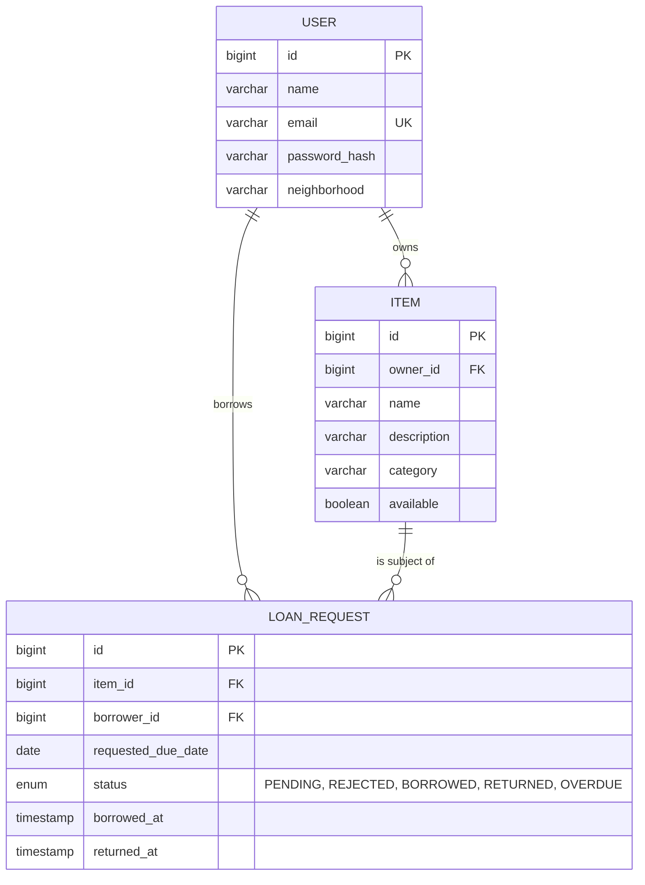

# TrustLend — Neighborhood Item Lending Library

A full-stack app for lending items (tools, books, equipment) within a community. Owners list what
they're willing to lend; neighbors request to borrow; owners approve or reject; and a scheduled
background job automatically flags loans that go past their due date.

---

## 1. Why This Project (Interview Positioning)

| What interviewers test for | Where TrustLend demonstrates it |
|---|---|
| Non-CRUD business logic | Borrowing state machine (PENDING → BORROWED → RETURNED/OVERDUE) |
| Background/scheduled processing | `@Scheduled` job that sweeps and flags overdue loans |
| Data consistency across entities | Item `available` flag kept in sync with loan status changes |
| Auth & security | Spring Security + JWT |
| REST API design | Resource-based endpoints, proper status codes, DTOs |
| Frontend state management | React Router, protected routes, Axios interceptors, Context API |

The scheduled job is the feature most likely to spark a good interview conversation — be ready to
explain why overdue status is computed by a background sweep instead of on-the-fly at read time
(durability, ability to trigger side effects like notifications, cheaper reads).

---

## 2. Tech Stack

**Backend:** Java 17, Spring Boot 3.x, Spring Security + JWT, Spring Data JPA, Spring Scheduling, MySQL, Maven, Lombok
**Frontend:** React 18, React Router v6, Axios, Context API, Tailwind CSS

---

## 3. Domain Model



**Lifecycle (the core logic to know cold):**

```
PENDING --(owner approves)--> BORROWED --(returned by either party)--> RETURNED
PENDING --(owner rejects)-->  REJECTED
BORROWED --(scheduled job, requestedDueDate < today)--> OVERDUE --(returned)--> RETURNED
```

Every transition into `BORROWED` flips `item.available = false`; every transition into `RETURNED`
flips it back to `true`. This is enforced in `LoanService`, not left to the frontend, so the data
can never drift out of sync no matter what client calls the API.

---

## 4. The Scheduled Job

`OverdueCheckScheduler` runs on a cron defined in `application.properties`
(`trustlend.overdue-check-cron`, default: daily at 1 AM). Each run:

1. Queries all `BORROWED` loans whose `requestedDueDate` is before today
2. Flips their status to `OVERDUE`
3. Logs how many were flagged (a real system would also fire notifications here)

For a live demo, temporarily set the cron to `*/30 * * * * *` (every 30 seconds) so you can show
an item flip to OVERDUE in real time without waiting a day.

---

## 5. Folder Structure

**Backend**
```
src/main/java/com/trustlend
├── config          (SecurityConfig, SchedulingConfig)
├── controller       (AuthController, ItemController, LoanController)
├── dto
├── entity          (User, Item, LoanRequest)
├── repository
├── scheduler       (OverdueCheckScheduler)
├── security        (JwtAuthFilter, JwtUtil, UserDetailsServiceImpl)
├── service         (AuthService, ItemService, LoanService, CurrentUserService)
└── exception
```

**Frontend**
```
src/
├── api/            (axios instance + endpoint functions)
├── components/      (Navbar, ItemCard, LoanRow)
├── context/         (AuthContext)
├── pages/          (Login, Register, Browse, MyItems, Loans)
├── routes/         (ProtectedRoute)
└── App.jsx
```

---

## 6. API Summary

| Method | Endpoint | Purpose |
|---|---|---|
| POST | `/api/auth/register` | Create account |
| POST | `/api/auth/login` | Get JWT |
| GET | `/api/items?category=` | Browse available items (public) |
| POST | `/api/items` | List a new item |
| GET | `/api/items/mine` | Items I've listed |
| DELETE | `/api/items/{id}` | Remove a listing (blocked if currently on loan) |
| POST | `/api/loans` | Request to borrow an item |
| GET | `/api/loans/borrowed` | My requests as a borrower |
| GET | `/api/loans/lending` | Requests against items I own |
| PATCH | `/api/loans/{id}/approve` | Owner approves → item becomes unavailable |
| PATCH | `/api/loans/{id}/reject` | Owner rejects |
| PATCH | `/api/loans/{id}/return` | Either party marks it returned → item available again |

All endpoints except `/api/auth/**` and `GET /api/items/**` require `Authorization: Bearer <jwt>`.

---

## 7. Setup Instructions

### Backend
```bash
cd trustlend-backend
# create the DB or let createDatabaseIfNotExist=true handle it
# edit src/main/resources/application.properties with your MySQL credentials
mvn clean install
mvn spring-boot:run
# → http://localhost:8080
```

### Frontend
```bash
cd trustlend-frontend
npm install
cp .env.example .env
npm run dev
# → http://localhost:5173
```

---
